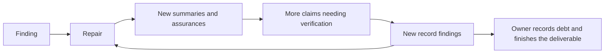

# Independent review of HAVDM's recurring review loops

**Author:** OpenAI Codex / GPT-6, 2026-09-10.
**Reviewer:** Claude Fable — joint review requested by the owner; pending. This is Codex's independent analysis, not a cross-check of Fable's analysis.
**Owner gate:** recommendations only. Adoption requires the owner's decision after Codex and Fable have reviewed the proposed changes.
**Evidence snapshot:** `4dc042320183efa0b6e0695c5ed67fc4857dfd58`, local `main`; the merge of F9a is already present. Historical comparisons below name their own endpoints.
**Scope:** why authoring, review, repair and record keeping repeatedly extend delivery; includes Codex's contribution, governance, handoffs, testing and role allocation.

Fable's `prompts/fable/START_F9A_LOOP_ANALYSIS.md` was read as context, as requested. Its task was not executed, its embedded diagnosis was not adopted, and Fable's new analysis was not read. Historical Fable work is evidence where explicitly cited below. This session has an institutional interest: earlier Codex reviews and recommendations are among the work being assessed. A fresh session reduces carryover; it does not make a vendor's assessment of its own history disinterested.

## 1. Verdict and recommendation

**CLEAR-WITH-FINDINGS**, scoped to this process assessment. No product, implementation, release or proposed governance change is approved by this verdict. The process risks below are SEV 2; no present shipping component is designated blocked.

**The loops have several causes, but the strongest common amplifier is that a small repair becomes a larger deliverable, carrying new explanations and assurances that then need correcting.** Incomplete author checks and late reviewer discoveries feed that cycle. The workflow does not consistently separate a defect worth reporting from a defect worth repairing before the next delivery stage.

The first independent review remains valuable. F9a's first review caught an impossible test instruction and ambiguity in required behavior. Later spacing-helper reviews still found consequential acceptance failures. Removing independent review, or approving automatically after a fixed number of rounds, would lose useful protection.

My recommendation is to retain independent review and change what happens around it: make the first pass broader in the ways that matter, keep repairs and their records smaller, and finish a deliverable when its remaining findings have an explicit disposition. A clean report must not become an unstated completion requirement. Trial the changes through ordinary product work before adding more governance machinery.

### Owner Summary Table

These are risks in the working system, not a new repair list for the already-locked F9a brief. Complexity estimates describe the proposed process adjustment, not a measured delivery estimate.

| Ref | What is going wrong, in plain English                                                                     | Severity | Blocks | Fix complexity (1–5) | Recommendation                                                                       |
| --- | --------------------------------------------------------------------------------------------------------- | -------- | ------ | -------------------- | ------------------------------------------------------------------------------------ |
| LA1 | Small corrections keep delivery open even when the work can proceed with the remaining problems recorded. | SEV 2    | None   | 2                    | Owner judgement needed: trial explicit finish decisions, or retain current practice. |
| LA2 | A repair adds explanations that become the next round's faulty material.                                  | SEV 2    | None   | 2                    | Owner judgement needed: shorten new delivery records while preserving history.       |
| LA3 | Authors and reviewers check individual examples without sufficiently checking the surrounding behavior.   | SEV 2    | None   | 3                    | Owner judgement needed: strengthen the first pass and repair verification.           |
| LA4 | Reviewer advice can introduce a defect, while reviewers also discover old defects late.                   | SEV 2    | None   | 2                    | Owner judgement needed: assess reviewers and their proposed remedies explicitly.     |
| LA5 | Handoffs and memory summaries change the meaning, scope or date of evidence.                              | SEV 2    | None   | 2                    | Owner judgement needed: use shorter references to stable evidence.                   |
| LA6 | Rules and their checking machinery become another project with its own repair loops.                      | SEV 2    | None   | 3                    | Owner judgement needed: preserve the pause and simplify selectively after a trial.   |
| LA7 | Review cost is judged by the size of the edit, without adequately pricing the follow-up work it creates.  | SEV 2    | None   | 2                    | Owner judgement needed: trial cost-aware closure and proportionate verification.     |

The six-field decision briefs in §5 group these related choices so the owner need not adjudicate overlapping process findings separately.

## 2. Evidence and limits

The principal case is F9a: its seven committed reviewer reports, the dated disposition sections and addenda, the relevant review/repair history, and selected brief and source passages. I re-derived the round sequence, file sizes, reviewer identifiers and specific disputed provenance from Git. I also examined selected finding sequences from the C3 parser, spacing-helper plan, self-pass gate, B14 severity codification and theme badge, plus the PR #139 process audit and PR #144 cross-check. B7's closing review provides a useful example of a bounded clearance.

This is a deliberately selected set of expensive chains, not a random sample of HAVDM changes. It establishes recurring mechanisms and counterexamples; it does not establish a repository-wide escape rate, a typical round count, or a comparative model ranking. The older cases are targeted comparisons, not fresh full reviews of those implementations. Their historical severity labels predate or span calibration changes and must not be added together as comparable measures of harm.

Primary evidence is committed material. Memory supplied the practice index, relevant review rules, the governance pause, the review-philosophy decision and the final F9a ruling. The pause is `drawer_havdm_decisions_89b5f20cc75d3f70a7e0491b`; the philosophy record is `drawer_havdm_decisions_6a7a86f1c8af85a3082e8a1c`. The owner's present request authorizes this retrospective and recommendations. It does not itself adopt a new mechanism. No governing rule, source, test, earlier review, brief, disposition record, board item or live state was edited for this assessment.

**Not established:** hidden model reasoning; whether a reported check was actually omitted rather than ineffective, except where the record explicitly admits omission; complete private session chronology; historical memory versions as a complete population; current external board/Issue state; billed model usage; attended human hours; product regressions after delivery; or how Fable will assess these recommendations. No live Home Assistant operation or new Electron/e2e/integration run was performed. The analysis does not verify that the future F9a implementation works.

### Claim ledger

| Claim                                                                                                                             | Status                                       | Evidence and boundary                                                                                                                                                                                                          |
| --------------------------------------------------------------------------------------------------------------------------------- | -------------------------------------------- | ------------------------------------------------------------------------------------------------------------------------------------------------------------------------------------------------------------------------------ |
| F9a contains seven independent reviewer reports, with 17 distinct P-identifiers; the disposition addendum separately names S1–S4. | MEASURED                                     | Pinned Git inventory and heading extraction in Appendix B; finding genealogy in Appendix A. These are identifiers, not 21 independent reviewer discoveries.                                                                    |
| Later F9a work shifted toward repairing the evidence and process record.                                                          | MEASURED locations; INFERRED workflow effect | R6 P10–P14, R7 P12/P15–P17; target edits distinguished from record edits below. R5 contains an older reviewer miss and does not fit a simple “all repair-generated” account.                                                   |
| An earlier Codex-prescribed parser repair introduced the next false rejection.                                                    | MEASURED                                     | P16 recommendation, `60f191e..1d68876` source diff, P19, and replay of the historical functions using installed `yaml@2.9.0`; Appendix B.                                                                                      |
| The rules already provide non-clean terminal dispositions and scoped follow-up.                                                   | MEASURED                                     | [Operating Agreement §3.4](../governance/OPERATING_AGREEMENT.md#34-implementation-slices--the-review-lifecycle), especially the decision/repair distinction; [review template](../templates/ADVERSARIAL_REVIEW.md), §§1 and 4. |
| Rule and record volume plausibly increases interpretation and synchronization work.                                               | INFERRED                                     | Measured document growth; specific mismatches P6, P12, P13 and P17. Volume alone does not prove an attention failure.                                                                                                          |
| Smaller records and an explicit finish decision should reduce avoidable rounds.                                                   | JUDGEMENT                                    | Supported by the final F9a disposition and the mechanisms below; prospective benefit remains unmeasured.                                                                                                                       |

**Weakest claims:** the amount of time these proposals would save; whether a new reviewer would find more useful defects earlier; and whether process changes alone would materially improve author checking. The retained evidence does not support assigning a percentage of blame to author, reviewer, rules or owner.

## 3. What F9a actually shows

Round numbers here mean the first review followed by six follow-ups. A filename ending `followup5` is round 6.

| Round | Live findings after that review    | Main contribution                                                                                                              | Decision path recorded afterward                                                                                                        |
| ----- | ---------------------------------- | ------------------------------------------------------------------------------------------------------------------------------ | --------------------------------------------------------------------------------------------------------------------------------------- |
| 1     | P1 SEV 1; P2/P3 SEV 2; P4/P5 SEV 3 | Correct the impossible failing-baseline instruction, acceptance ambiguity, overstated saved evidence and inaccurate summaries. | Repair. Author argued for immediate correction of P4/P5 despite reviewer's fix-later advice.                                            |
| 2     | P3 SEV 2; P5/P6 SEV 3              | Expose an incomplete evidence qualification, a repair's false preservation claim and inaccurate dependency declarations.       | Repair; the cost dependants were not fully corrected.                                                                                   |
| 3     | P3 SEV 2                           | Expose the remaining difference between evidence of some add-on and evidence of the target add-on.                             | Reviewer proposed acceptance and progression; owner chose the author's proposal to delete the unsupported claim.                        |
| 4     | P3 SEV 3                           | Confirm withdrawal of the capability claim; identify remaining cost-record discrepancies.                                      | Reviewer proposed acceptance and lock; owner chose a dated correction and wider sweep.                                                  |
| 5     | P7/P8/P9 SEV 3                     | Correct provenance summaries, export-destination shorthand and a memory heading.                                               | Reviewer proposed acceptance and lock; author reconsidered, and owner chose repair.                                                     |
| 6     | P10–P14 SEV 3                      | Correct new verification and review-history prose.                                                                             | **Codex recommended correction now**, including a target edit and another scoped check. Author also found S1–S4 before the next review. |
| 7     | P12/P15/P16/P17 SEV 3              | Correct causal attribution and claims about the new self-check evidence.                                                       | Owner deferred the findings after judging that they would not change the spec's work. No target repair was made.                        |

Sources: the [first review](f9a-brief-codex-review.md), [first follow-up](f9a-brief-codex-review-followup.md), [second](f9a-brief-codex-review-followup2.md), [third](f9a-brief-codex-review-followup3.md), [fourth](f9a-brief-codex-review-followup4.md), [fifth](f9a-brief-codex-review-followup5.md), [sixth](f9a-brief-codex-review-followup6.md), and [dispositions](f9a-brief-repair-dispositions.md).

Several qualifications change the diagnosis supplied in the context prompt:

- **“21 findings” mixes discovery sources.** There are 17 reviewer P-identifiers and four author S-identifiers. P12 is reopened; P3 carries changing remainders; S3/S4 close through one edit. Identifier totals are useful inventory, not independent defects prevented.
- **The provenance shift is real, but its clean division is not.** P6 is already about repair records in round 2. P5 includes a newly introduced preservation error. R5's P8 existed in the original brief and had been missed by Codex. R6 P10 is in the brief's verification section; P11–P14 are in explanatory records. R7's remaining findings concern the record. “Original artifact” and “author's repair” are not mutually exclusive locations or causes.
- **The four state-drift examples are not proved to have been true when written.** Most decisively, S2's 30/12 counts disagree with the brief's 33/13 counts at `35fcf5a`, before the later repairs blamed for the difference. R7 explicitly leaves the supposed earlier accurate measurement unverified. A remeasurement does not automatically disprove a past measurement either: P7 is an inconsistent current provenance account, not proof of the date of every private execution.
- **“The reviewer recommended locking five times” needs its conditions.** R3/R4/R5 supported proceeding with a residual. R6 called the brief ready but recommended another correction and check first. R7 separated lock from record correction. Those are materially different recommendations.
- **A missed self-check is not automatically an unperformed self-check.** Round 4's addendum explicitly admits that a commissioned self-check had not been run. The broader Round 6 diagnosis that Round 5's record was never checked was rejected in R7 and recorded as unproven. It must not become this retrospective's established root cause.

### The observable cost

On the fixed F9a range `691c8d1..123ccfe`, Git contains **19 branch commits** and **nine changed paths, all under `docs/`**. At `123ccfe`, the brief occupies **61,518 bytes**, its dispositions **102,430 bytes**, and the seven reviewer reports together **218,529 bytes**. The brief at the first reviewed head `00b9abf` was **41,743 bytes**. These are UTF-8 file sizes, including Markdown table padding, not token bills or measures of necessary content. Appendix B reproduces the figures.

The committer timestamps from the first review `926c0a8` to the seventh `67099d1` span about **30.2 hours**. This includes waiting and overnight time. It is not 30.2 hours of attended work and excludes work before the first review. No defensible monetary total is available here.

Rounds 5–7 bought more accurate summaries, preserved evidence boundaries and a better retrospective record. They did not establish a new implementation or report a remaining SEV 1/2 in F9a. Their value was not zero: a misleading process history can cause a bad governance decision, which is precisely why this analysis checks it. That value does not require keeping the brief open until the history is immaculate.

**Earliest defensible counterfactual:** round 3 could have ended brief review with explicit acceptance of P3 and an obligation to settle the actual evidence in the spec. That was a real choice, not equivalent to proving the remaining statement correct. **Round 4 is the stronger stopping point:** the unsupported capability guidance was gone, and the reviewer described only a SEV 3 cost-record remainder. The owner's later downstream-impact test plausibly supports finishing there. This would have avoided rounds 5–7 _on the brief_, while leaving any necessary historical correction for later. It does not prove zero later work or that every later discovery was avoidable.

## 4. Why the loops recur

### LA1 — Completion and correction are coupled too tightly

**SEV 2; Blocks: None.** The current rule has an exit: DEFERRED and ACCEPTED-RESIDUAL are owner decisions, not repairs. The review template allows CLEAR-WITH-FINDINGS. Nevertheless, F9a's [Round 5 conclusion](f9a-brief-repair-dispositions.md#follow-up-owed-4) described the exits as a clean round or accepted residual, omitting deferral. P13 corrected that explanation. The system therefore had a usable exit that the handoff account failed to present accurately.

The stronger operational problem survives that wording correction. Agents repeatedly describe small edits as cheap, then accept the ensuing review as an unavoidable fixed cost. The owner receives “this is real, it is easy to fix, and it misleads a reader,” which makes correction sound prudent even when the delivery benefit is small. The recorded owner choices were valid; the recommendations did not consistently price the whole resulting cycle.

Trust also matters. Round 5 records the owner questioning whether acceptance was recommended on merit or just to stop the loop; the author admitted the latter was part of its reasoning. After repeated false assurances, another assurance that a defect is harmless is understandably weak evidence. A finish recommendation therefore needs to explain what the next stage will actually rely on and why the remaining discrepancy cannot change that decision, or acknowledge the uncertainty. “It is only SEV 3” is insufficient on its own. This explains a plausible amplification of the recorded choices; it is not a diagnosis of the owner's motives.

**Class examined:** F9a's decision rows, lock recommendations, actual target repairs and the current lifecycle. Not every extra round was automatic: the owner explicitly chose repairs. The countermeasure is a clearer choice about completion and repair together, not an accusation that the owner violated a rule.

### LA2 — Repairs manufacture new assertions to review

**SEV 2; Blocks: None.** F9a's P3 repair introduces or retains claims about derivability and comparative cost; P5 introduces a false “preserved unedited” statement; P7's repair adds a comparison summary that becomes P10; the subsequent self-check account produces P15/P16/P17. The underlying problem becomes surrounded by explanations about why it was fixed correctly.

The observed cycle is:



This does not mean documentation is dispensable. It means repeated descriptions of the same measurement, an evolving count and an unsupported explanation add obligations without necessarily helping the next implementer. The increase in file sizes is consistent with that mechanism; the named repair-to-finding links establish it more directly than size does.

There is an important counterexample to indiscriminate shortening. [Spacing-helper SP-31](spacing-helper-preset-plan-codex-followup7-review.md#sp-31--sev-1--the-deletion-removed-the-mandatory-harness-contract-and-ruled-boundaries) found that cutting the plan removed the conditions needed to make its tests meaningful. Shorten history and repeated assurances; preserve current requirements, exceptions, starting conditions and acceptance evidence.

**Class examined:** F9a's evolving evidence/repair prose, plus the spacing plan's deletion failure. These show both excessive additions and excessive removal; “write less” alone is not an adequate remedy.

### LA3 — Checking is narrower than the behavioral claim

**SEV 2; Blocks: None.** F9a's first P3 repair used a source comment to support a claim contradicted by the function beneath it. Subsequent wording recognized a resource marker but still did not require evidence matching the target add-on. P6 confused “nothing upstream changed” with “nothing upstream was relied upon.” Those are failures to evaluate the claim being made, not merely proofreading omissions.

The older cases show why checking another example is insufficient. Parser P12/P16/P19/P20 successively reached effective version, warning fallback, valid uses of the same warning, and repeated declarations. Spacing [SP-21](spacing-helper-preset-plan-codex-followup4-review.md#sp-21--sev-1--p4-silently-passes-a-wrong-control-operation-when-the-requested-value-is-already-satisfied) and [SP-25](spacing-helper-preset-plan-codex-followup5-review.md#sp-25--sev-1--the-other-half-guard-still-passes-a-double-pre-satisfied-wrong-control-operation) distinguish checking a final value from identifying which control received an operation. A repair checked against the first failing example can still fail along a neighboring dimension.

Loading a rule is access to an instruction, not evidence of its execution. The artifacts support specific explanations: an omitted dependency, reliance on a misleading comment, a test of the wrong property, a check performed before later prose was added, or a self-check that failed to detect the error. They do not reveal a single psychological reason that an agent “ignored” a loaded rule.

**Class examined:** these explicit evidence-to-claim mismatches and the F9a admission of one omitted self-check. No claim is made that an exhaustive input partition was available or affordable for every mechanism. The proposal is to front-load relevant distinctions and state uncovered ones, not promise exhaustive correctness.

### LA4 — Codex is part of the cause, not just the detector

**SEV 2; Blocks: None.** Three concrete contributions require changes on the reviewer side.

First, **late misses**: F9a's initial review already stated the correct file-versus-HA destination split, but did not flag the contradictory summary. The [R5 report explicitly admits this](f9a-brief-codex-review-followup4.md#p8--sev-3--content-producers-are-described-collectively-as-ha-senders). A new identifier in a later round is not evidence that the author introduced it in the latest repair.

Second, **a defective prescription**: parser [P16](plan-consistency-c3-parser-implementation-review-followup.md#p16--sev-2--unsupported-numeric-yaml-directives-bypass-p12s-repair) advised rejecting `BAD_DIRECTIVE` warnings. The subsequent source diff installs that predicate. [P19](plan-consistency-c3-parser-implementation-review-followup2.md#p19--sev-2--bad_directive-conflates-an-invalid-version-with-a-valid-reserved-directive) then finds that this rejects a reserved directive that the promised contract accepts. Replaying the historical functions reproduced the change: the selected C3 result is clear at `60f191e`, rejects at `1d68876`, and is clear again at `b817a42`. Both the author's adoption and Codex's recommendation need scrutiny. The F9a-only observation that this risk did not materialize there cannot settle the broader question.

Third, **disproportionate next-step advice**: F9a R6 correctly graded its findings SEV 3, but recommended another target correction and follow-up because the answers were readily available. It did not establish that this bought enough delivery value to outweigh another cycle. The forecast of one bounded correction was not a measured cost bound. R7 again put “Fix now” in the owner table while recommending lock plus record correction in its narrative; a non-developer must reconcile those signals.

Codex also helped expand the governance workload. The [PR #139 process review](pr139-author-process-review-codex.md#the-one-process-change) called a zero-UNRUN execution ledger the cheapest change. The later self-pass gate reviews exposed defects in the checking mechanism and its coverage claims; its [round-6 close-out](self-pass-gate-codex-round6-review.md#r5-m2--partly) still disputed a population count even though the omitted scope surface was correctly worded. That history does not prove the ledger had no value. It does refute treating its projected cheapness as demonstrated.

**Class examined:** reviewer misses, remedy recommendations and proportionality advice in these named cases. This is not a model league table. Changing vendors may help a specific blind spot; it will not by itself remove a workflow that keeps commissioning record corrections.

### LA5 — Handoffs create lossy and stale copies of evidence

**SEV 2; Blocks: None.** The local P7/P8/P9 handoff says its enumeration is “already done and verified,” but describes one brief passage where the review identified framing and conclusion passages. [Round 5 records the recovery](f9a-brief-repair-dispositions.md#-the-sibling-sweep-found-a-fourth-brief-member-the-hand-off-had-dropped). Its own heading then miscounts the recovered population and becomes P11. The successful recovery and the new record error can both be true.

There is also a distinction between **where a sentence was first written**, **when it became false**, **when the problem was detected**, and **where it was copied**. P12 and P17 repeatedly collapse those questions. S2 is especially useful because the fixed blobs disprove the later timing explanation without requiring speculation about hidden reasoning.

The review record, author-added memory interpretation, current state and next commission sometimes repeat the same conclusion. A confident summary can then be mistaken for additional evidence. The final analysis should cite the review and source, rather than treating several copies as independent corroboration. The context prompt itself contains historical branch/PR state that no longer describes this checkout; that is ordinary aging of a handoff, not authority to reverse the observed merge.

**Class examined:** the retained local repair prompt, F9a's review/disposition pairs and cited memory records. Historical prompts are gitignored and less durable than the committed record. I did not infer that every session suffers context loss or that a larger context window would solve this.

### LA6 — Governance has itself become a recurring defect surface

**SEV 2; Blocks: None.** Existing governance already demands independent review, whole-class sweeps, qualified evidence, owner decisions, scoped repair follow-up, proportional depth and cost triggers. The absence of another instruction is therefore an incomplete explanation.

The history shows successive efforts to regulate review creating work of their own. The [PR #139 audit](pr139-defect-pattern-audit.md) traces a mechanical evidence-only classifier created during a repair. The current [Operating Agreement §3.4](../governance/OPERATING_AGREEMENT.md#34-implementation-slices--the-review-lifecycle) records its removal after repeated false accepts. The self-pass gate then needed its own review chain. B14's [P3 remainder](b14-severity-rulings-codex-plan-review-followup.md#p3-remainder--sev-1--any-artifact-change-makes-the-review-record-recursive) explicitly identified a rule that would make the review record recursive. The C3 checker went on to need repeated parser-boundary repairs. These findings were often valid against the contracts being claimed; the contracts' cost is part of the design choice.

At this snapshot, `ai_rules.md`, `CLAUDE.md`, the Operating Agreement and adversarial-review template total **103,581 bytes**. That is a defined subset, not the whole instruction load. Memory and the strategy records add further authority and exceptions. The Operating Agreement calls itself pointer-style, but carries extensive historical explanation. The measured concern is the number of surfaces a change must reconcile; claiming that their length caused a particular model lapse would exceed the evidence.

One incentive deserves explicit reconsideration: [§3.3](../governance/OPERATING_AGREEMENT.md#33-rollback-triggers-named-in-advance) treats repeated clean reviews as a reason to revisit the pairing, while the review template says a clean result is legitimate. Reassessment is reasonable, but zero findings can also indicate successful prevention. This could reward finding production rather than useful risk reduction. I found no evidence of deliberate finding fabrication and do not allege it.

**Class examined:** these governance mechanisms, their recorded failure chains and present operative text. No claim is made that removing all governance would improve delivery. Preserve the protections against self-approval, unsafe execution, unsupported evidence and unreviewed consequential repairs.

### LA7 — The workflow underprices total effort and repeats evidence at the wrong level

**SEV 2; Blocks: None.** A complexity-1 edit can cause an owner decision, an updated record, a memory correction, a new commission, a gate run and another review. Its implementation size is not its transaction cost. F9a's Round 5 records repeated full gates after edits and a failed unit run; the exact historical execution-to-tree sequence is not independently re-established here. The reviewer reports themselves repeatedly distinguish repository health from proof of the prose.

The rules also create opportunities to escalate effort mechanically: a deeper flaky repeat, more review material, another evidence declaration. Some are valuable. In PR #137, the first independent behavioral rerun found a failure the author had not observed, as [OA §3.5](../governance/OPERATING_AGREEMENT.md#35-reviewer-re-run-scope-binding) records. That does not mean another unchanged runtime suite verifies a newly written date count.

Nor should “docs-only” become a blanket testing exemption: this repository has tests that consume plan and governance text. Verification should follow what changed and what consumes it. Changing the branch head by adding a review report does not by itself falsify a historical test result; claiming that result proves the new prose would be a different error. Existing mandatory checks remain in force until a reviewed change is adopted.

**Class examined:** F9a's published verification/cost claims, the actual `tools/checks` commands, and the governing rerun rule. Attended time, billing and causal attribution of the historical flaky failure remain unmeasured.

## 5. Proposed changes — Owner Decision Briefs

These are a coordinated proposal for joint review, not operative amendments. A choice to trial them should identify any departure from the existing rules before the affected work starts. The pause is not silently lifted, and the already-locked F9a brief is not reopened.

### Decision A — Finish by delivery impact and disposition

1. **Protects:** progress to usable product work while keeping consequential defects visible.
2. **Problem:** “true and easy to correct” repeatedly becomes “must correct before proceeding,” even where the rules allow finishing.
3. **Product affected:** **Unknown prospectively**; the F9a record establishes avoidable delay risk, not a new product failure. A wrong requirement or false release assurance can still affect the product and belongs on the repair path.
4. **Options and costs:** retain the present case-by-case approach, with its observed round-trip burden; trial an explicit finish decision after the first review and each repair check; or impose automatic approval after a fixed number of rounds. The trial needs clearer recommendations in existing records. Automatic approval is simpler but can pass a consequential defect, as the late spacing findings illustrate.
5. **Recommendation and why:** trial the middle option. Present the result the next stage may rely on, the remaining findings, and the concrete harm from proceeding. Use existing DEFERRED/ACCEPTED-RESIDUAL decisions where warranted. Aim for one full review and one bundled repair check; if another repair cycle is proposed, explain its additional delivery benefit and the continue/reduce/park choices. This is an effort target and escalation point, **not an approval cap**. Known consequential defects remain subject to review and the owner's gate.
6. **Do nothing:** a clean report can remain the practical target despite nonblocking verdicts. Small, valid findings continue to reopen work.

For a future F9a-like case: an incorrect rule that the spec will copy needs correction or explicit acceptance. A disputed count of historical gate runs may be recorded for the retrospective while the spec proceeds. A historical record supplying the release's sole safety evidence is consequential even though its file is called a record. Route by use and impact, not filename or severity label alone.

### Decision B — Smaller current artifacts and simpler handoffs

1. **Protects:** a next author who can identify current requirements and evidence without reconstructing the entire review history.
2. **Problem:** current guidance, historical wording, superseding explanations and self-assurances are mixed together and copied between surfaces.
3. **Product affected:** **Unknown for future changes**; F9a and SP-31 show opposite risks: excessive explanation creates new defects, but deleting necessary acceptance detail also creates defects.
4. **Options and costs:** retain growing narratives; write concise current guidance with links to preserved historical records; or collapse briefs and specs broadly. The second requires editorial discipline. Broad collapse saves a handoff but risks losing independent decisions and would change current lane/seat rules.
5. **Recommendation and why:** choose concise current guidance first. In new work, keep the objective, scope, settled decisions, genuine open questions and acceptance evidence clear. Use existing disposition rows for Ref, decision, repair, affected dependencies and proof; avoid adding an essay about the perfection of that proof. Handoffs name the source report and finding, reviewed version and pending action rather than replacing the finding with a claimed-complete summary. Preserve append-only records. Consider a combined brief/spec only as a separately agreed trial for bounded low-risk work, not by silently changing capability-class F9a.
6. **Do nothing:** each revision remains responsible for maintaining more repeated claims, while the next session must resolve more historical qualifications.

Where a number is needed, give it a fixed population and cutoff. Where it is not needed, omit it. A saved command can support reproduction; it must not be presented as a decision procedure for meaning merely because it returns a neat count.

### Decision C — Improve first review and repair quality on both sides

1. **Protects:** finding meaningful failures before repeated handoffs and preventing a proposed fix from creating its successor defect.
2. **Problem:** attention follows the latest example, while adjacent states, dependency uses and opposite failure directions are examined later.
3. **Product affected:** **Yes historically** for some reviewed behavior/acceptance contracts; no current product regression is newly established here. The historical parser replay directly demonstrates a repair-caused false rejection.
4. **Options and costs:** continue example-by-example repair; spend more focused effort before the first handoff and on the complete repair; or prohibit reviewers from suggesting fixes. More focused checking has an upfront cost. A prescription ban sacrifices useful concrete guidance and does not stop the author independently inventing a defective remedy.
5. **Recommendation and why:** choose focused checking. Before handoff, author and reviewer each consider the relevant normal, invalid, missing/unknown and transition cases, plus ordering or repeated operations where the mechanism uses them. Use current acceptance sections and review scope, not a new universal checklist. For a repair, check the failing example, a nearby valid control, affected callers and the strongest guarantee newly asserted. Treat a reviewer's proposed remedy as a hypothesis the author must verify; the reviewer also tests the assumptions in its own recommendation. Keep valid passing-baseline controls where no honest failing baseline exists. Label what was not examined.
6. **Do nothing:** another local patch can satisfy the last counterexample while preserving the broader defect or introducing the opposite error.

On a same-seam recurrence, prefer reassessing the promised contract and simplest adequate implementation before adding another special case. Defect reports should distinguish the broken requirement, evidence, affected behavior and optional remedy. A late discovery should say whether it predates the repair and whether the earlier review examined that area. These distinctions can live in existing finding text; they do not need another ledger.

### Decision D — Simplify governance and memory after evidence from a trial

1. **Protects:** quality controls that agents and the owner can apply consistently without maintaining a second product made of workflow machinery.
2. **Problem:** useful principles accumulate exceptions, repeated histories and automation whose own contract expands the review workload.
3. **Product affected:** **Unknown in aggregate**; particular review and verification protections have demonstrated value, and removing them wholesale would be unsupported.
4. **Options and costs:** add more rules/checkers now; leave the present rules and records intact indefinitely; or retain the pause, trial changed behavior, then remove specific redundancy through a small reviewed amendment. New machinery costs implementation, testing and future repair. Indefinite stasis retains known friction. Selective simplification has a bounded migration and verification cost.
5. **Recommendation and why:** choose selective simplification after the trial. Keep one operative statement of each rule, short pointers elsewhere, and history at its existing historical home. Keep live memory focused on active work, decisions and references, rather than copied reviews plus new diagnoses. Do not add a checker whose promise is general prose completeness, reviewer independence or semantic truth. Evaluate a narrow mechanical check only against a measured recurrent cost and representative valid/invalid cases. Revisit clean-review triggers using useful detections, known misses and later escapes, rather than treating low finding yield itself as failure.
6. **Do nothing:** the next loop is likely to generate another instruction, which creates another surface to maintain without showing that existing execution improved.

This is not authorization for a wholesale governance rewrite, a memory purge, a new policy index or automatic reviewer orchestration. The current pause is evidence that the owner has already recognized this tradeoff; use its product-work retrospective rather than starting a parallel governance program.

### Decision E — Trial cost-aware verification and accountable review roles

1. **Protects:** confidence per unit of owner attention, test time and model effort.
2. **Problem:** the records track findings and proofs more readily than the whole cost of obtaining them; neither a role change nor a new gate has yet been shown here to solve the observed loops.
3. **Product affected:** **Unknown prospectively**. Narrowing tests incorrectly can miss a regression; repeating irrelevant checks can delay delivery without verifying the changed claim.
4. **Options and costs:** retain present verification and seat rules; immediately reassign roles and reduce gates; or keep the cross-vendor check while trialing targeted improvements and measuring their result. Immediate wholesale change would confound author, reviewer, scope and test effects. The trial has modest recording cost if it uses existing PR/review summaries.
5. **Recommendation and why:** run the coordinated trial below. Keep consequential independent review, and verify each proposed remedy rather than assuming a vendor boundary validates it. Propose any test-policy narrowing as an explicit reviewed amendment: preserve required full-PR checks and tests that consume changed documents; avoid repeating unrelated runtime work solely to refresh an unchanged result after a report edit. Record what was run, against which version, and what remains unverified. Do not use repeated green runs to erase a failure. Attribute late misses and introduced defects to their actual author/reviewer stage before changing seats.
6. **Do nothing:** the owner continues deciding from small edit-size estimates and incomplete cost attribution, so the relative value of a different workflow remains unknown.

## 6. Joint review and a bounded trial

The user requested independent analyses and review by both Codex and Fable of changes. This document supplies one analysis. Agreement is not presumed, and this author cannot independently approve its own proposal.

Proposed sequence, for the owner's consideration:

1. **Finish the independent analyses.** Preserve both as evidence. Each distinguishes findings about history from prospective recommendations.
2. **Cross-review the substantive differences.** Fable checks this report's causal links, recommendations and cost assumptions; Codex checks Fable's. Keep factual disagreement, policy preference and unresolved evidence separate. Do not rewrite each report until their prose matches.
3. **Put a concrete proposal to the owner.** Use one existing decision document containing the agreed changes, any disagreement and the exact rule departures needed for the trial. Both models review that same version. Material changes afterward return to both; editorial history alone does not justify reopening unrelated product work. An unresolved policy difference goes to the owner with plain-language options rather than another persuasion loop.
4. **Trial through the next three suitable product changes**, aligning with the existing pause's product-work horizon. This proposed observation set is not a claim that its existing trigger has already fired. Do not add a standalone trial dashboard, gate or ledger. Retain present rules except for departures the owner expressly adopts after joint review.
5. **Assess before codifying.** In existing close-out records, capture initial and follow-up review counts, whether findings changed deliverable behavior, known misses, defects introduced by repairs, owner decisions and available effort measurements. Separate wall-clock elapsed time from attended time. Check subsequent tests/UAT for escapes. Compare similar work; a docs brief and a shared timing helper are not interchangeable samples.

**Proposed success criterion:** fewer follow-ups and less owner coordination for comparable work, with credible first-pass coverage and no observed increase in consequential escapes during the observation window. Three changes can justify continuing or revising a trial; they cannot establish a reliable population defect rate.

**Proposed intervention point:** if another round repeats the same seam or chiefly repairs assurance prose, use the existing continue/residual/park decision immediately. If a real blocker remains, simplify, repair or park the affected work; do not approve by count. If a trial change demonstrably lets consequential work through without the intended review or test, suspend that change and restore the prior protection while its cause is assessed.

This sequence is proposed only. No commission was sent to Fable, no agent was spawned in its place, and no operational change has been applied.

## Appendix A — F9a finding genealogy

“Origin” identifies the observed defect surface or transition, not the author's mental cause. P-identifiers are from Codex reports; S-identifiers are author self-findings. The first review sees an already-revised brief at `00b9abf`; “initial” here refers to that reviewed artifact, not necessarily its first draft.

| Ref | First reported      | Observed origin and later significance                                                                                                                                                                                                                      |
| --- | ------------------- | ----------------------------------------------------------------------------------------------------------------------------------------------------------------------------------------------------------------------------------------------------------- |
| P1  | R1                  | Initial verification instruction removed the qualification for already-passing controls. Closed in R2.                                                                                                                                                      |
| P2  | R1                  | Initial acceptance explanation weakened settled obligations. Closed in R2; repairing its history contributed to P5.                                                                                                                                         |
| P3  | R1                  | Initial overstatement about captured add-on evidence; successive repairs left narrower unsupported conditions and cost dependants. Capability guidance withdrawn by R4; cost-record closure confirmed R5. Mixed inherited and repair-related constructions. |
| P4  | R1                  | Initial UI-consumer summary omitted placed cards. Closed R2.                                                                                                                                                                                                |
| P5  | R1                  | Initial historical-options completeness claim; R2 also found a newly shortened proposal falsely called unedited. Closed R3.                                                                                                                                 |
| P6  | R2                  | Round 1 repair rows confused unchanged upstream sources with absent upstream reliances. Closed R3.                                                                                                                                                          |
| P7  | R5                  | Current provenance declarations conflicted after the brief's facts and evidence account evolved. Original wording alone cannot establish the accuracy of the original private measurement. Closed R6.                                                       |
| P8  | R5                  | Export-destination shorthand existed in the original brief. Codex had the correct split in R1 but missed the inconsistent shorthand. Closed R6.                                                                                                             |
| P9  | R5                  | Live-state lesson heading disagreed with its list. Memory maintenance, not a brief-code defect. Closure confirmed R6.                                                                                                                                       |
| P10 | R6                  | Round 5 brief repair called F7 both changed and unchanged in an output summary. Closed R7 after deletion and further cleanup.                                                                                                                               |
| P11 | R6                  | Round 5 record heading miscounted the brief passages recovered from the handoff. Closed R7.                                                                                                                                                                 |
| P12 | R6                  | Round 5 attribution wrongly assigned P8 to repairs. Round 6's correction then confused sentence authorship with introduced falsity and omitted a cutoff. Remaining record obligation deferred R7.                                                           |
| P13 | R6                  | Round 5's account of available exits omitted DEFERRED, despite the existing governing rule. Closed R7.                                                                                                                                                      |
| P14 | R6                  | Round 5's gate-run account omitted a retained later green run. R7 accepted the corrected record; this analysis does not reconstruct the historical log archive.                                                                                             |
| P15 | R7                  | Round 6's self-check asserted no ranges existed while using ranges. No incorrect range membership was alleged. Deferred.                                                                                                                                    |
| P16 | R7                  | Round 6 addendum overstated what S1/S2's unchanged measurements proved about corrections. Deferred. Distinct from the parser P16 discussed in LA4.                                                                                                          |
| P17 | R7                  | Round 6 addendum wrongly dated S2's discrepancy and omitted the prior review as a known reader. Deferred.                                                                                                                                                   |
| S1  | Author, R6 addendum | An inherited count of owner/reviewer disagreements was propagated without an adequate recount; the addendum supplies the corrected enumeration.                                                                                                             |
| S2  | Author, R6 addendum | 30/12 locator counts already disagreed with 33/13 at the pre-session committed head. Their later causal explanation is refuted by P17. Earlier accuracy remains unverified.                                                                                 |
| S3  | Author, R6 addendum | New P10 repair prose said a summary occurred once when it occurred twice. Removed with S4 in one edit.                                                                                                                                                      |
| S4  | Author, R6 addendum | A second output summary survived the instruction to remove the summary. Removed with S3.                                                                                                                                                                    |

A useful future analysis separates three axes: origin/version, the kind of verification failure, and impact on the next delivery stage. Assigning each finding solely to “rule breach” or “state drift” loses information: a later edit can cause drift, a checker can miss it, and a handoff can propagate it. This is an analytical distinction for the retrospective, not a proposal for another mandatory tracking table.

## Appendix B — Reproduction

Run these read-only commands from the repository root. Their populations are deliberately pinned; they do not grow when this report or a later review is committed.

### Inventory and sizes

```bash
python3 - <<'PY'
import re
import subprocess
from datetime import datetime

def git(*args):
    return subprocess.check_output(['git', *args])

base, tip = '691c8d1', '123ccfe'
brief = 'docs/features/F9A_EXPORT_CAPABILITY_PROFILE_BRIEF.md'
dispositions = 'docs/reviews/f9a-brief-repair-dispositions.md'
paths = git('diff', '--name-only', base, tip).decode().splitlines()
reviews = [p for p in paths if re.search(
    r'f9a-brief-codex-review(?:-followup[2-6]?)?\.md$', p)]
print('branch commits:', len(git('rev-list', f'{base}..{tip}').splitlines()))
print('paths:', len(paths), paths)
print('outside docs:', [p for p in paths if not p.startswith('docs/')])
for rev, path in [('00b9abf', brief), (tip, brief), (tip, dispositions)]:
    print(rev, path, 'bytes:', len(git('show', f'{rev}:{path}')))
print('review files:', len(reviews))
print('review bytes:', sum(len(git('show', f'{tip}:{p}')) for p in reviews))
refs = set()
for p in reviews:
    refs.update(re.findall(r'^### (P\d+) —',
                          git('show', f'{tip}:{p}').decode(), re.M))
print('P-identifiers:', sorted(refs, key=lambda x: int(x[1:])))
start, end = [datetime.fromisoformat(
    git('show', '-s', '--format=%cI', rev).decode().strip())
    for rev in ['926c0a8', '67099d1']]
print('committer timestamp interval, hours:', (end-start).total_seconds()/3600)
rule_paths = ['ai_rules.md', 'CLAUDE.md',
              'docs/governance/OPERATING_AGREEMENT.md',
              'docs/templates/ADVERSARIAL_REVIEW.md']
print('four instruction documents, bytes:', sum(
    len(git('show', f'4dc0423:{p}')) for p in rule_paths))
PY
```

The identifier extraction inventories headings, not semantic defects. Appendix A supplies the human interpretation and includes the separately identified S-findings.

### S2's disputed timing

```bash
python3 - <<'PY'
import re
import subprocess

brief = 'docs/features/F9A_EXPORT_CAPABILITY_PROFILE_BRIEF.md'
dispositions = 'docs/reviews/f9a-brief-repair-dispositions.md'
for rev in ['35fcf5a', '23c91c7', '980d90a', 'b39a6cf']:
    def read(path):
        return subprocess.check_output(
            ['git', 'show', f'{rev}:{path}']).decode()
    lines = read(brief).splitlines()
    counts = [sum(bool(re.search(pattern, line)) for line in lines)
              for pattern in ['2026-09-0[0-9]|September', 'measured|re-measur']]
    record = read(dispositions)
    print(rev, counts, 'old counts retained:',
          '30 hits' in record and '12 hits' in record)
PY
```

Observed: `[33, 13]` and retained 30/12 wording at each named head. This disproves the proposed later-repair timing; it does not identify the unretained tree on which the author might originally have measured something else.

### Reviewer-prescribed parser repair

````bash
git diff 60f191e 1d68876 -- tests/support/planConsistency.ts
node <<'JS'
const { execFileSync } = require('node:child_process');
const Module = require('node:module');
const path = require('node:path');
const ts = require('typescript');
console.log('yaml version:', require('yaml/package.json').version);
const spec = '```ts\nx(): void { this.x(); }\n```\n\n' +
  '```yaml\n# plan-running-totals\n%FOO bar\n---\n' +
  'review_rounds_complete: 7\nreviewer_findings: 30\n' +
  'findings_after_round_one: 24\n```';
for (const rev of ['60f191e', '1d68876', 'b817a42']) {
  const filename = path.resolve('tests/support/planConsistency.ts');
  const source = execFileSync('git',
    ['show', `${rev}:tests/support/planConsistency.ts`], { encoding: 'utf8' });
  const loaded = new Module(filename, module);
  loaded.filename = filename;
  loaded.paths = Module._nodeModulePaths(path.dirname(filename));
  loaded._compile(ts.transpileModule(source, { compilerOptions: {
    module: ts.ModuleKind.CommonJS,
    target: ts.ScriptTarget.ES2022,
    esModuleInterop: true,
  }}).outputText, filename);
  console.log(rev, loaded.exports.checkPlan({ spec })
    .filter(f => f.code.startsWith('C3-')));
}
JS
````

Observed with installed `yaml@2.9.0`: C3 results `[]`, `C3-NOCANONICAL`, `[]` respectively. The source is loaded from the named Git blobs in memory; no historical checkout or tracked source is changed. This is a focused C3 replay using the installed dependencies, not a rerun of each historical branch's whole suite. An initial scratch fixture without a method declaration was rejected by C1's liveness check; it was corrected before drawing the C3 conclusion.

## Verification of this report

The published Appendix B commands were extracted and executed: each returned exit 0 and reproduced the results stated above. Local source-link targets and heading anchors were checked. With the analysis draft present, `./tools/checks` completed with real exit **0**: lint (**0 errors / 145 warnings**), formatting, typecheck and unit tests (**1559 passed / 105 files**). Log: `/tmp/havdm-review-loop-analysis-checks.log`. The final explanatory paragraph and verification/memory notes were added afterward; the final report received a targeted Prettier check. The full gate is not represented as a test of those later prose edits.

No new test was written for this documentation artifact. Runtime suites cannot establish its causal interpretations; Fable's independent cross-review remains pending. The owner requested a local documentation commit on 2026-09-10 after the initial delivery. This report changes no operational rule or product behavior.

## MemPalace drawer candidates

MemPalace accepted an investigation pointer and session diary entry: `drawer_havdm_review_a86e723d2688590d648c1d10`. The pointer marks the recommendations unratified and joint review pending; it is not an adopted practice rule. No live state was updated. The historical code, review and disposition files remain the evidence for the named cases, and this report is the full analysis.
